# Development Guide

Everything you need to set up a development environment, run tests, and
contribute to sqlalchemy-cubrid.

---

## Table of Contents

- [Prerequisites](#prerequisites)
- [Installation](#installation)
- [Project Structure](#project-structure)
- [Make Targets](#make-targets)
- [Running Tests](#running-tests)
- [Docker Integration Testing](#docker-integration-testing)
- [Multi-Version Testing](#multi-version-testing)
- [Code Coverage](#code-coverage)
- [Code Style](#code-style)
- [Pre-Commit Hooks](#pre-commit-hooks)
- [CI/CD Pipeline](#cicd-pipeline)

---

## Prerequisites

| Requirement | Version |
|---|---|
| Python | 3.10+ |
| Git | any |
| Docker | any (for integration tests) |
| Docker Compose | v2+ |

---

## Installation

### Quick Setup

```bash
git clone https://github.com/cubrid-lab/sqlalchemy-cubrid.git
cd sqlalchemy-cubrid
make install
```

`make install` performs:
1. `pip install -e ".[dev]"` — editable install with dev dependencies
2. `pip install pytest-cov pre-commit tox` — test tooling
3. `pre-commit install` — git hook setup

### Manual Setup

```bash
# Create and activate a virtual environment
python3 -m venv venv
source venv/bin/activate  # Linux/macOS
# venv\Scripts\activate   # Windows

# Install in editable mode with dev dependencies
pip install -e ".[dev]"

# Install test coverage and multi-version tools
pip install pytest-cov tox

# (Optional) Install pre-commit hooks
pip install pre-commit
pre-commit install
```

---

## Project Structure

```mermaid
graph TD
    root["sqlalchemy-cubrid/"]

    pkg["sqlalchemy_cubrid/ - Main package"]
    tests["test/ - Test suite"]
    docs["docs/ - Documentation"]
    samples["samples/ - Usage examples"]
    pyproject["pyproject.toml - Project config, dependencies"]
    tox["tox.ini - Multi-Python test config"]
    docker["docker-compose.yml - CUBRID Docker setup"]
    makefile["Makefile - Development shortcuts"]
    contributing["CONTRIBUTING.md - Contribution guidelines"]

    root --> pkg
    root --> tests
    root --> docs
    root --> samples
    root --> pyproject
    root --> tox
    root --> docker
    root --> makefile
    root --> contributing

    pkg --> init["__init__.py - Public API, version, type exports"]
    pkg --> base["base.py - ExecutionContext, IdentifierPreparer"]
    pkg --> compiler["compiler.py - SQL/DDL/Type compilers"]
    pkg --> dialect["dialect.py - CubridDialect (reflection, connection, etc.)"]
    pkg --> pycubrid_dialect["pycubrid_dialect.py - Pure Python driver dialect"]
    pkg --> aio_dialect["aio_pycubrid_dialect.py - Async pycubrid.aio dialect"]
    pkg --> dml["dml.py - ON DUPLICATE KEY UPDATE, MERGE constructs"]
    pkg --> trace["trace.py - Query tracing utility"]
    pkg --> types["types.py - CUBRID type system"]
    pkg --> req["requirements.py - SA 2.0 test requirement flags"]
    pkg --> alembic["alembic_impl.py - Alembic migration support"]
    pkg --> typed["py.typed - PEP 561 marker"]

    tests --> tcomp["test_compiler.py - SQL compilation tests"]
    tests --> ttypes["test_types.py - Type system tests"]
    tests --> tdialect["test_dialect_offline.py - Dialect tests (no DB)"]
    tests --> tbase["test_base.py - Base module tests"]
    tests --> treq["test_requirements.py - SA requirement flag tests"]
    tests --> tdml["test_dml.py - DML construct tests"]
    tests --> talembic["test_alembic.py - Alembic integration tests"]
    tests --> taio["test_aio_pycubrid_dialect.py - Async dialect tests"]
    tests --> taioint["test_aio_integration.py - Async integration tests"]
    tests --> tjson["test_json.py - JSON type and path tests"]
    tests --> tpackaging["test_packaging.py - Packaging and entry point tests"]
    tests --> tshowcreate["test_show_create_table.py - Reflection parser tests"]
    tests --> ttrace["test_trace.py - Query trace tests"]
    tests --> tintegration["test_integration.py - Live DB integration tests"]
    tests --> tsuite["test_suite.py - SA test suite runner"]
    tests --> tconftest["conftest.py - Test fixtures"]
```



---

## Make Targets

All common development tasks are available via `make`:

```bash
make help          # Show all available targets
make install       # Install in dev mode with all dependencies
make lint          # Run ruff linter + format checks
make check-tool-versions # Verify local/CI tool pins and type-check cells agree
make typecheck     # Report versions and run strict mypy
make format        # Auto-fix lint issues and format code
make test          # Run offline tests with coverage (95% threshold)
make test-all      # Run tox across all Python versions
make integration   # Start Docker → run integration tests → stop Docker
make docker-up     # Start CUBRID Docker container
make docker-down   # Stop and remove CUBRID Docker container
make clean         # Remove build artifacts and caches
```

---

## Running Tests

### Strict Type Checking

Run `make typecheck` in the development environment. It reports Python,
SQLAlchemy, Alembic and mypy versions, then runs
`python3 -m mypy sqlalchemy_cubrid/ --config-file=pyproject.toml`.
The mypy version is pinned to `2.3.1` in the dev dependencies.

CI runs the same Makefile target in two cells: Python 3.10 / SQLAlchemy 2.0.53
and Python 3.13 / SQLAlchemy 2.1.1. Both cells are blocking: the required
`matrix-result` check fails if the type-check job fails, is cancelled or is
skipped. Ruff and the existing offline tests with 95% minimum coverage also
remain required. To choose a virtualenv interpreter locally, use
`make typecheck PYTHON=/path/to/venv/bin/python`.

### Offline Tests (No Database Required)

Async adapter fixtures in synchronous unit tests consume their actual coroutine
entry through the await bridge and assert that it was awaited. Patch both the
connection bridge (SQLAlchemy 2.0) and module bridge (2.1) when applicable; a
mock that simply returns a cursor can hide an invalid adapter and leak an
unawaited coroutine into pytest's garbage-collection checks.

The majority of the test suite runs without a live CUBRID instance:

```bash
# Run all offline tests
pytest test/ -v --ignore=test/test_integration.py --ignore=test/test_suite.py \
  --ignore=test/test_aio_integration.py

# Run with coverage report
pytest test/ -v --ignore=test/test_integration.py --ignore=test/test_suite.py \
  --ignore=test/test_aio_integration.py \
  --cov=sqlalchemy_cubrid --cov-report=term-missing

# Run a specific test file
pytest test/test_compiler.py -v

# Run a single test
pytest test/test_compiler.py::TestCubridSQLCompiler::test_select_limit -v
```

### Property-Based Fuzz Tests (Hypothesis)

`test/test_fuzz_*.py` use [Hypothesis](https://hypothesis.readthedocs.io/) to
generate SELECT/INSERT/DDL combinations the hand-written suite never enumerated
and assert dialect invariants (no unexpected compile exception, placeholder ==
parameter count, LIMIT/OFFSET cardinality, DDL/reflection round-trip). The
offline fuzz tests run in the normal offline suite; live-execution fuzz tests
are `integration`-marked.

```bash
# Fast profile (default, ~50 examples/test) — runs with the offline suite
pytest test/test_fuzz_select.py -v

# Extended profile (2000 examples/test) — the nightly bug-hunt profile
HYPOTHESIS_PROFILE=nightly pytest test/test_fuzz_select.py -v

# Live-execution fuzzing (requires CUBRID)
export CUBRID_TEST_URL="cubrid+pycubrid://dba@localhost:33000/testdb"
HYPOTHESIS_PROFILE=nightly pytest test/test_fuzz_select.py -m integration -v
```

Profiles (`dev`, `ci`, `nightly`) are registered in `test/conftest.py` and
selected via `HYPOTHESIS_PROFILE`. PR CI uses the fast profile; the nightly
`integration-full` workflow runs the extended profile against live CUBRID.

### Integration Tests (Requires CUBRID)

```bash
# Start a CUBRID container
docker compose up -d

# Wait for CUBRID to be ready (healthcheck: ~30s)
docker compose logs -f cubrid

# Set the connection URL
export CUBRID_TEST_URL="cubrid+pycubrid://dba@localhost:33000/testdb"

# Run the regular tox profile (installs the existing pure-driver extra)
tox -e integration

# Run a focused sync file in an environment with pycubrid installed
pytest test/test_integration.py -v

# Run async integration tests
pytest test/test_aio_integration.py -v

# Stop the container
docker compose down -v
```

The regular tox profile requires an explicit `cubrid+pycubrid` URL. It rejects
missing URLs and legacy C-extension schemes, then probes both sync and derived
async connections with bounded `SELECT 1` requests before pytest. Async suites
derive `cubrid+aiopycubrid` with SQLAlchemy's URL API, retaining credentials,
ports and query options; `CUBRID_TEST_AURL` remains an explicit async override.
Failures do not print URL credentials. Without the optional native C-extension,
the driver-differential comparisons are intentionally skipped;
that profile does not claim to test CUBRIDdb. Formal CI's native-driver
`--dburi` route remains separate and unchanged.

### Full SA Test Suite

```bash
# Requires a running CUBRID instance
pytest test/test_suite.py --dburi cubrid://dba@localhost:33000/testdb
pytest test/test_suite.py --dburi cubrid+pycubrid://dba@localhost:33000/testdb
```

Known failures are baselined per driver and SQLAlchemy version; see
[SQLAlchemy compliance lanes](#sqlalchemy-compliance-lanes).

---

## Docker Integration Testing

### docker-compose.yml

The project includes a `docker-compose.yml` for local CUBRID instances:

```yaml
services:
  cubrid:
    image: cubrid/cubrid:${CUBRID_VERSION:-11.2}
    environment:
      CUBRID_DB: testdb
    ports:
      - "33000:33000"
    healthcheck:
      test: ["CMD", "csql", "-u", "dba", "testdb", "-c", "SELECT 1"]
      interval: 15s
      timeout: 10s
      retries: 10
      start_period: 30s
```

### Testing Against Different CUBRID Versions

```bash
# Default (11.2)
docker compose up -d

# Specific version
CUBRID_VERSION=11.4 docker compose up -d
CUBRID_VERSION=11.0 docker compose up -d
CUBRID_VERSION=10.2 docker compose up -d
```

### Supported CUBRID Versions

| Version | Docker Image |
|---|---|
| 11.4 | `cubrid/cubrid:11.4` |
| 11.2 | `cubrid/cubrid:11.2` (default) |
| 11.0 | `cubrid/cubrid:11.0` |
| 10.2 | `cubrid/cubrid:10.2` |

### Quick Integration Workflow

```bash
# One-command: start, test, stop
make integration
```

`make integration` attempts `docker compose down -v` on shell exit, including
after failed startup, readiness waiting or tests. The original failure is preserved
if cleanup also fails; cleanup failure after passing tests also makes the command
fail. Cleanup errors are reported explicitly. This does not guarantee cleanup after
an untrappable termination such as `SIGKILL` or a host shutdown.

For an already-running server, set `CUBRID_TEST_URL` and use `make integration-local`.
That target never starts or stops Docker and leaves the external server running.

---

## Multi-Version Testing

### tox Configuration

The `tox.ini` defines local offline environments for Python 3.10–3.14, a pinned
Ruff lint environment, and `typecheck-sa20` / `typecheck-sa21` environments that
run the same Makefile target and pinned SQLAlchemy/Python pairs as CI. Tox uses
the existing pycubrid/Alembic extras and development test dependencies. Offline
selection is `-m "not integration"`; the integration environment selects
`-m integration` with `--ignore=test/test_suite.py`. The formal SQLAlchemy
compliance suite requires the testing plugin enabled by `--dburi`; existing CI
runs it separately with that argument and its known-failure baseline. Regular
tox integration does not run the formal suite. The offline threshold remains 95%.

```ini
[tox]
envlist = lint, typecheck-sa20, typecheck-sa21, py310, py311, py312, py313, py314
skip_missing_interpreters = true
```

### Running tox

```bash
# Install tox
pip install tox

# Run all environments
tox

# Run a specific Python version
tox -e py312

# Run lint checks only
tox -e lint

# Check both designated SQLAlchemy typing environments
tox -e typecheck-sa20,typecheck-sa21
```

### CI Matrix

The CI pipeline tests the following matrix:

| | Python 3.10 | Python 3.11 | Python 3.12 | Python 3.13 | Python 3.14 |
|---|:---:|:---:|:---:|:---:|:---:|
| **Offline Tests** | ✅ | ✅ | ✅ | ✅ | ✅ |
| **CUBRID 11.4** | ✅ | — | — | — | ✅ |
| **CUBRID 11.2** | ✅ | — | — | — | ✅ |
| **CUBRID 11.0** | ✅ | — | — | — | ✅ |
| **CUBRID 10.2** | ✅ | — | — | — | ✅ |

---

## Code Coverage

### Requirements

- **Minimum threshold**: 95% line coverage
- **Current CI offline collection**: 603 tests (`pytest --collect-only` excluding `test_integration.py`, `test_suite.py`, and `test_aio_integration.py`, matching `.github/workflows/ci.yml` and `make test`)
- **Current line coverage**: ~98.26% offline in the CI/make test configuration
- CI enforces the threshold via `--cov-fail-under=95`

### Running Coverage

```bash
# With coverage report
pytest test/ -v \
  --ignore=test/test_integration.py \
  --ignore=test/test_suite.py \
  --ignore=test/test_aio_integration.py \
  --cov=sqlalchemy_cubrid \
  --cov-report=term-missing \
  --cov-fail-under=95

# Or via make
make test
```

### Known Unreachable Lines

Three lines in `compiler.py` and one in `dml.py` are verified unreachable by design (defensive fallbacks that
cannot trigger through SA's public API):

| File | Line | Description |
|---|---|---|
| `compiler.py` | 72 | `for_update_clause` returning `""` |
| `compiler.py` | 84 | `limit_clause` returning `""` |
| `compiler.py` | 298--300 | Defensive branch in DDL compilation |
| `dml.py` | 310 | `else` branch in type normalization |

---

## Code Style

### Ruff

This project uses [Ruff](https://docs.astral.sh/ruff/) for both linting and
formatting.

| Setting | Value |
|---|---|
| Line length | 100 characters |
| Target Python | 3.10+ |
| Linter | `ruff check` |
| Formatter | `ruff format` |

### Running Checks

```bash
# Check tooling consistency and lint/format all maintained Python sources
make lint

# Apply fixes and formatting over the same shared source paths
make format
```

---

## Pre-Commit Hooks

Pre-commit hooks run lint and format checks automatically on `git commit`.

Ruff/mypy versions are single-sourced from the dev pins in `pyproject.toml`.
The isolated mypy hook follows interpreter compatibility: Python 3.10 installs
SQLAlchemy 2.0.53, and Python 3.11+ installs SQLAlchemy 2.1.1 (which requires
Python 3.11+), using exact conditional dependencies for the async extra. It also
installs the existing Alembic supported range, then checks `sqlalchemy_cubrid/`
with the project's strict configuration. It does not install stubs automatically or
suppress missing imports. Ruff's explicit `include = ["*.py", "*.pyi"]` and
the matching hook types keep CLI, CI and hooks on Python sources rather than
rewriting documentation snippets.

The shared `LINT_PATHS` in the Makefile covers the package, tests, scripts,
demos, samples and `docs/source` Python configuration. CI and tox invoke
`make lint`; the hooks keep checking all tracked Python/pyi files. The drift
checker rejects omitted maintained directories or a runner that bypasses this
shared target.

When updating a tool pin, update its pre-commit revision and tox pin in the same
change; update the CI mypy pin when applicable. SQLAlchemy type-check pairs are
read from CI by `scripts/check_tool_versions.py`. Run `make check-tool-versions`,
`pre-commit run --all-files` and `tox -e lint,typecheck-sa20,typecheck-sa21` after
the update. The consistency check runs through CI lint, tox lint and a local
pre-commit hook, so a dependency-only update cannot silently leave old pins.

### Setup

```bash
pip install pre-commit
pre-commit install
```

### Manual Run

```bash
# Run all hooks on all files
pre-commit run --all-files
```

---

## CI/CD Pipeline

### GitHub Actions Workflows

| Workflow | File | Trigger |
|---|---|---|
| CI | `.github/workflows/ci.yml` | Push to main, PRs |
| Publish | `.github/workflows/publish-pypi.yml` | GitHub Release |

### CI Pipeline Steps

1. **Lint** — Ruff check + format verification
2. **Offline Tests** — Python 3.10, 3.11, 3.12, 3.13, 3.14 × offline test suite
3. **Integration Tests** — Python {3.10, 3.14} × CUBRID {10.2, 11.0, 11.2, 11.4}, plus async integration coverage and the blocking [SQLAlchemy compliance lanes](#sqlalchemy-compliance-lanes) for CUBRIDdb and released pycubrid
4. **Coverage** — Enforces ≥ 95% threshold

### Driver-differential lane

`test/test_driver_differential.py` runs the same SQLAlchemy operations on
pycubrid and the CUBRIDdb C-extension and asserts they agree. It covers basic
CRUD plus the DB-API contract areas that already work on the released drivers:
Core `executemany` with integer, UTF-8/CJK and NULL values, textual
`executemany` with integer and UTF-8/CJK values, scalar binds, textual-SQL
result column names, and commit/rollback visibility. It also compares
constraint-violation exception classes (#480), results read across a
rollback (#481), and scalar `cursor.description` names, type codes and
`null_ok` (#482). NOT NULL/foreign-key classes, post-rollback results and
`null_ok` are fixed on pycubrid `main` but not released, so the pycubrid side
of those cases is a strict xfail on released pycubrid (see
[Unreleased pycubrid fixes](#unreleased-pycubrid-fixes-cubrid_pycubrid_upstream)).
Areas still blocked upstream are tracked separately (#483–#484); LOB values are
covered by #485.

The integration jobs in `ci.yml` and `integration-full.yml` run this module
with both drivers installed and `CUBRID_REQUIRE_DRIVER_DIFFERENTIAL=1`. With
that variable set, `test/conftest.py` fails the session when no differential
case ran and passed, so a lane where both drivers fail to connect cannot
report success. Before the tests, `python -m scripts.report_driver_versions`
writes the exact Python, SQLAlchemy, pycubrid, CUBRIDdb (package version and
source tag) and CUBRID server versions to the job log and the GitHub step
summary. Local runs without the variable keep skipping cleanly when a driver
or the database is unavailable:

```bash
export CUBRID_TEST_URL="cubrid://dba@localhost:33000/testdb"
CUBRID_REQUIRE_DRIVER_DIFFERENTIAL=1 pytest test/test_driver_differential.py -v -rs
```

### SQLAlchemy compliance lanes

The official SQLAlchemy dialect compliance suite (`test/test_suite.py`, run
with `--dburi`) blocks merges in two driver lanes. Both are steps of the
`integration-tests` job in `ci.yml`, reuse that cell's CUBRID service, and
therefore fail `matrix-result` when they fail:

| Lane | URL | Pinned versions | CI cell |
|---|---|---|---|
| `cubrid@sa2.0` | `cubrid://` (CUBRIDdb C-extension) | cubrid-python v11.3.0.51, SQLAlchemy 2.0.53 | Python 3.14 × CUBRID 11.4 |
| `pycubrid@sa2.0` | `cubrid+pycubrid://` (recommended) | pycubrid 1.7.1, SQLAlchemy 2.0.53 | Python 3.10 × CUBRID 10.2 |
| `pycubrid@sa2.1` | `cubrid+pycubrid://` (recommended) | pycubrid 1.7.1, SQLAlchemy 2.1.1 | Python 3.14 × CUBRID 11.4 |

The two pycubrid lanes split SQLAlchemy 2.0 and 2.1 across the two PR cells,
so each cell runs the suite for pycubrid only once (SQLAlchemy 2.1 needs
Python 3.11+, so it runs in the 3.14 cell). Every lane baseline was captured on
fresh CUBRID 10.2 and 11.4 databases. Each pycubrid step
first runs `python -m scripts.report_driver_versions`, which records the exact
Python, SQLAlchemy, pycubrid and CUBRID server versions in the job log and step
summary. The CUBRIDdb suite in the CUBRID 10.2 cell stays non-gating.

**Known failures are keyed per lane.** Every entry in `test/known_failures.txt`
names the lanes it fails in, as `<driver>@sa<major.minor>`, or as
`<driver>@sa<major.minor>@cubrid<major.minor>` when it fails on one CUBRID
server version only:

```text
test/test_suite.py::DistinctOnTest::test_distinct_on  cubrid@sa2.0 pycubrid@sa2.0 pycubrid@sa2.1
test/test_suite.py::NumericTest::test_float_as_decimal  cubrid@sa2.0
```

`test/conftest.py` derives the current lane from the `--dburi` dialect, the
installed SQLAlchemy version and the connected server version, and applies a strict xfail only to the entries
tagged for it. A CUBRIDdb-only failure therefore cannot hide a pycubrid
regression, and vice versa. There is no wildcard tag, and an untagged entry or
a lane CI does not gate (e.g. `pycubrid@sa2.2`) is a load error. With `CUBRID_STRICT_KNOWN_FAILURES=1` (set by every gating step)
the run also fails when:

- a listed test passes (strict XPASS): remove that lane's tag;
- a listed entry for the lane matches no collected test (stale baseline);
- a listed entry is skipped instead of xfailed, so it no longer proves
  anything: drop it or fix the skip;
- the lane has no entries at all, so a new driver or SQLAlchemy minor cannot
  gate on an empty baseline by accident;
- the installed SQLAlchemy is not the release the lane was captured with
  (`_PINNED_SQLALCHEMY` in `test/conftest.py`).

The manifest parser also rejects a node id listed twice, and a server-narrowed
tag that is not one of the (lane, server) pairs CI gates
(`_GATED_SERVER_LANES`: `cubrid@sa2.0@cubrid11.4`, `pycubrid@sa2.0@cubrid10.2`,
`pycubrid@sa2.1@cubrid11.4`), so a typo'd or never-exercised server tag cannot
slip in.

Tests that cannot apply to CUBRID at all (for example seven-digit precision
from the single-precision `FLOAT`, or non-ASCII identifiers on a non-UTF-8
database) are excluded in `sqlalchemy_cubrid/requirements.py` with a reason
instead of being listed. Every requirement property must return a **new**
`exclusions.open()` / `exclusions.closed()` object: SQLAlchemy extends the
first requirement of a stacked `@testing.requires` chain in place, so a shared
object silently turns every other requirement closed and skips most of the
suite (`test_stacked_requirements_do_not_leak_into_other_properties` guards
this).

**Updating a lane baseline** (a SQLAlchemy bump, a new pinned pycubrid, or a
fix that makes a listed test pass):

```bash
export CUBRID_TEST_URL="cubrid+pycubrid://dba@localhost:33000/testdb"
pip install "pycubrid==1.7.1" "sqlalchemy[asyncio]==2.1.1"
# 1. Capture: without strict mode, a missing lane just applies no xfails.
pytest test/test_suite.py --dburi="$CUBRID_TEST_URL" --maxfail=1000 -q -r fE
# 2. Classify every failure (dialect bug, driver limitation, backend/suite
#    limit), link its issue, and edit only this lane's tags.
# 3. Verify exactly as CI does.
CUBRID_STRICT_KNOWN_FAILURES=1 pytest test/test_suite.py --dburi="$CUBRID_TEST_URL" -q
```

Run the capture against both CUBRID 10.2 and 11.4 when adding a lane, then
update the pinned versions in `ci.yml`, the header of
`test/known_failures.txt`, and the `_GATED_LANES` set in
`test/test_known_failures.py` in the same change.

### pycubrid release-candidate adoption

The weekly `upstream-canary.yml` run against `pycubrid@main` stays
non-blocking: it warns about upcoming regressions, but an unreleased upstream
HEAD must not block unrelated pull requests. Its failures are still reported:
when a canary job fails on a scheduled or manually dispatched run of the
default branch, the workflow
opens an issue titled "Upstream canary failing against pycubrid@main" (label
`ci`), or comments on it if it is already open, with the failing jobs, the run
link and the pycubrid commit tested, and closes it once both jobs pass again.
The dependency bound
`pycubrid>=1.3.2,<2.0` is widened only after a **specific** pycubrid release
candidate (or new major release), installed by exact version, passes the
downstream contract suite: the regular and async integration tests, the
required driver-differential lane above, and the SQLAlchemy compliance suite.
Record the versions reported by `scripts/report_driver_versions.py` in the
adoption pull request, and update `CHANGELOG.md` and the support documentation
with the newly supported range in the same change.

### Unreleased pycubrid fixes (`CUBRID_PYCUBRID_UPSTREAM`)

Contract tests for tracker #479 can land before the pycubrid release that fixes
the behavior they check. On the released driver such a case is marked with
`xfail_unreleased_pycubrid_fix(request, engine.dialect.driver, issue)` from
`test/pycubrid_upstream.py`, which applies
`xfail(strict=True, reason="cubrid-lab/pycubrid#NNN, fixed on main, unreleased")`
only to the `pycubrid` and `aiopycubrid` drivers. CUBRIDdb (`cubrid://`) cases
are never affected by it; a CUBRIDdb defect gets its own per-driver strict xfail.

pycubrid `main` keeps reporting the last released `__version__`, so the helper
does not inspect versions. Instead, `CUBRID_PYCUBRID_UPSTREAM=1` declares that
the installed pycubrid contains every gated upstream fix and turns the markers
into no-ops, so the same tests must pass. The `pycubrid@main`
integration job in `upstream-canary.yml` sets it. Set it locally only with such
a build:

```bash
pip install --force-reinstall "git+https://github.com/cubrid-lab/pycubrid.git@main"
CUBRID_PYCUBRID_UPSTREAM=1 pytest test/test_integration.py test/test_aio_integration.py -v
```

List the gated issues with `grep -rn "xfail_unreleased_pycubrid_fix(" test/`.

**Removing a marker after the release.** The regular lanes install the newest
pycubrid release in the supported range, so once a release containing a fix is
published, its cases report a strict XPASS and fail. Adopt that release: raise
the `pycubrid` lower bound to it and delete the `xfail_unreleased_pycubrid_fix`
calls naming the issue. When no call is left, delete `test/pycubrid_upstream.py`
and the `CUBRID_PYCUBRID_UPSTREAM` entry in `upstream-canary.yml`.

### Documentation gates

Documentation exceptions use a populated standalone physical source line
`Docs: not needed - <reason>` outside code, quotes or template comments, or the existing maintainer-managed
label. `make check-docs-reason` runs executable doctests and real event-JSON/workflow
regressions; `make check-all` and the docs-sync job run those same checks.
Translation help requests do not authorize a bypass: maintainers explicitly
approve the existing `translations-deferred` label and record follow-up. The
Korean-required and other-language advisory translation checks are unchanged.

### Publish Pipeline

Triggered on GitHub Release creation. Builds and publishes the package to PyPI.

---

*See also: [Contributing Guide](../CONTRIBUTING.md) · [Feature Support](FEATURE_SUPPORT.md) · [Connection Guide](CONNECTION.md)*
