# 개발 가이드 (한국어)

> 🌐 [DEVELOPMENT.md](https://github.com/cubrid-lab/sqlalchemy-cubrid/blob/main/docs/DEVELOPMENT.md)의 번역입니다. 영어 원문이 표준이며, 페이지 번역은 경고 수준의 동기화 규칙을 따릅니다.

개발 환경 설정, 테스트 실행, sqlalchemy-cubrid 기여에 필요한 모든 것.

---

## 목차

- [사전 준비](#사전-준비)
- [설치](#설치)
- [프로젝트 구조](#프로젝트-구조)
- [Make 타깃](#make-타깃)
- [테스트 실행](#테스트-실행)
- [Docker 통합 테스트](#docker-통합-테스트)
- [다중 버전 테스트](#다중-버전-테스트)
- [코드 커버리지](#코드-커버리지)
- [코드 스타일](#코드-스타일)
- [Pre-Commit 훅](#pre-commit-훅)
- [CI/CD 파이프라인](#cicd-파이프라인)

---

## 사전 준비

| 요구사항 | 버전 |
|---|---|
| Python | 3.10+ |
| Git | 아무 버전 |
| Docker | 아무 버전 (통합 테스트용) |
| Docker Compose | v2+ |

---

## 설치

### 빠른 설정

```bash
git clone https://github.com/cubrid-lab/sqlalchemy-cubrid.git
cd sqlalchemy-cubrid
make install
```

`make install`이 수행하는 것:
1. `pip install -e ".[dev]"` — dev 의존성과 함께 편집 가능 설치
2. `pip install pytest-cov pre-commit tox` — 테스트 도구
3. `pre-commit install` — git 훅 설정

### 수동 설정

```bash
# 가상 환경 생성 및 활성화
python3 -m venv venv
source venv/bin/activate  # Linux/macOS
# venv\Scripts\activate   # Windows

# dev 의존성과 함께 편집 가능 모드로 설치
pip install -e ".[dev]"

# 테스트 커버리지 및 다중 버전 도구 설치
pip install pytest-cov tox

# (선택) pre-commit 훅 설치
pip install pre-commit
pre-commit install
```

---

## 프로젝트 구조

```mermaid
graph TD
    root["sqlalchemy-cubrid/"]

    pkg["sqlalchemy_cubrid/ - Main package"]
    tests["test/ - Test suite"]
    docs["docs/ - Documentation"]
    samples["samples/ - Usage examples"]
    pyproject["pyproject.toml - Project config, dependencies"]
    tox["tox.ini - Multi-Python test config"]
    docker["docker-compose.yml - CUBRID Docker setup"]
    makefile["Makefile - Development shortcuts"]
    contributing["CONTRIBUTING.md - Contribution guidelines"]

    root --> pkg
    root --> tests
    root --> docs
    root --> samples
    root --> pyproject
    root --> tox
    root --> docker
    root --> makefile
    root --> contributing

    pkg --> init["__init__.py - Public API, version, type exports"]
    pkg --> base["base.py - ExecutionContext, IdentifierPreparer"]
    pkg --> compiler["compiler.py - SQL/DDL/Type compilers"]
    pkg --> dialect["dialect.py - CubridDialect (reflection, connection, etc.)"]
    pkg --> pycubrid_dialect["pycubrid_dialect.py - Pure Python driver dialect"]
    pkg --> aio_dialect["aio_pycubrid_dialect.py - Async pycubrid.aio dialect"]
    pkg --> dml["dml.py - ON DUPLICATE KEY UPDATE, MERGE constructs"]
    pkg --> trace["trace.py - Query tracing utility"]
    pkg --> types["types.py - CUBRID type system"]
    pkg --> req["requirements.py - SA 2.0 test requirement flags"]
    pkg --> alembic["alembic_impl.py - Alembic migration support"]
    pkg --> typed["py.typed - PEP 561 marker"]

    tests --> tcomp["test_compiler.py - SQL compilation tests"]
    tests --> ttypes["test_types.py - Type system tests"]
    tests --> tdialect["test_dialect_offline.py - Dialect tests (no DB)"]
    tests --> tbase["test_base.py - Base module tests"]
    tests --> treq["test_requirements.py - SA requirement flag tests"]
    tests --> tdml["test_dml.py - DML construct tests"]
    tests --> talembic["test_alembic.py - Alembic integration tests"]
    tests --> taio["test_aio_pycubrid_dialect.py - Async dialect tests"]
    tests --> taioint["test_aio_integration.py - Async integration tests"]
    tests --> tjson["test_json.py - JSON type and path tests"]
    tests --> tpackaging["test_packaging.py - Packaging and entry point tests"]
    tests --> tshowcreate["test_show_create_table.py - Reflection parser tests"]
    tests --> ttrace["test_trace.py - Query trace tests"]
    tests --> tintegration["test_integration.py - Live DB integration tests"]
    tests --> tsuite["test_suite.py - SA test suite runner"]
    tests --> tconftest["conftest.py - Test fixtures"]
```



---

## Make 타깃

모든 흔한 개발 작업은 `make`로 사용할 수 있습니다:

```bash
make help          # 사용 가능한 모든 타깃 표시
make install       # 모든 의존성과 함께 개발 모드 설치
make lint          # ruff 린터 + 포맷 검사 실행
make check-tool-versions # 로컬/CI 도구 핀과 타입 검사 셀 일치 확인
make typecheck     # 의존성 버전 출력 및 strict mypy 검사
make format        # 린트 문제 자동 수정 및 코드 포맷
make test          # 커버리지와 함께 오프라인 테스트 실행 (95% 임계값)
make test-all      # 모든 Python 버전에서 tox 실행
make integration   # Docker 시작 → 통합 테스트 실행 → Docker 중지
make docker-up     # CUBRID Docker 컨테이너 시작
make docker-down   # CUBRID Docker 컨테이너 중지 및 제거
make clean         # 빌드 산출물과 캐시 제거
```

---

## 테스트 실행

### 엄격한 타입 검사

개발 환경에서 `make typecheck`를 실행하세요. Python, SQLAlchemy, Alembic,
mypy 버전을 출력한 다음
`python3 -m mypy sqlalchemy_cubrid/ --config-file=pyproject.toml`를 실행합니다.
개발 의존성은 mypy `2.3.1`을 고정합니다.

CI는 Python 3.10 / SQLAlchemy 2.0.53과 Python 3.13 / SQLAlchemy 2.1.1의 두 셀에서
같은 Makefile 타깃을 실행합니다. 두 셀 모두 필수입니다. 타입 검사 잡이 실패하거나
취소되거나 건너뛰어지면 필수 `matrix-result` 검사가 실패합니다. Ruff와 95% 최소
커버리지의 기존 오프라인 테스트도 계속 필수입니다. 로컬 가상 환경 인터프리터를
지정하려면 `make typecheck PYTHON=/path/to/venv/bin/python`을 사용하세요.

### 오프라인 테스트 (데이터베이스 불필요)

동기 단위 테스트의 비동기 어댑터 픽스처는 실제 진입 코루틴을 await 브리지로
소비하고 대기 여부를 검증합니다. 필요한 경우 연결 브리지(SQLAlchemy 2.0)와
모듈 브리지(2.1)를 모두 패치하세요. 단순히 커서를 반환하는 mock은 잘못된
어댑터 상태를 숨기고 대기하지 않은 코루틴을 pytest의 가비지 수집 검사에 남깁니다.

대부분의 테스트 스위트는 라이브 CUBRID 인스턴스 없이 실행됩니다:

```bash
# 모든 오프라인 테스트 실행
pytest test/ -v --ignore=test/test_integration.py --ignore=test/test_suite.py \
  --ignore=test/test_aio_integration.py

# 커버리지 리포트와 함께 실행
pytest test/ -v --ignore=test/test_integration.py --ignore=test/test_suite.py \
  --ignore=test/test_aio_integration.py \
  --cov=sqlalchemy_cubrid --cov-report=term-missing

# 특정 테스트 파일 실행
pytest test/test_compiler.py -v

# 단일 테스트 실행
pytest test/test_compiler.py::TestCubridSQLCompiler::test_select_limit -v
```

### 속성 기반 퍼즈 테스트 (Hypothesis)

`test/test_fuzz_*.py`는 [Hypothesis](https://hypothesis.readthedocs.io/)를 사용해 손으로 작성한 스위트가 열거하지 않은 SELECT/INSERT/DDL 조합을 생성하고 dialect 불변식을 검증합니다(예상치 못한 컴파일 예외 없음, placeholder == 파라미터 개수, LIMIT/OFFSET 카디널리티, DDL/reflection 왕복). 오프라인 퍼즈 테스트는 일반 오프라인 스위트에서 실행되며, 라이브 실행 퍼즈 테스트는 `integration` 마커가 붙습니다.

```bash
# 빠른 프로파일 (기본, 테스트당 ~50 예제) — 오프라인 스위트와 함께 실행
pytest test/test_fuzz_select.py -v

# 확장 프로파일 (테스트당 2000 예제) — nightly 버그 헌트 프로파일
HYPOTHESIS_PROFILE=nightly pytest test/test_fuzz_select.py -v

# 라이브 실행 퍼징 (CUBRID 필요)
export CUBRID_TEST_URL="cubrid+pycubrid://dba@localhost:33000/testdb"
HYPOTHESIS_PROFILE=nightly pytest test/test_fuzz_select.py -m integration -v
```

프로파일(`dev`, `ci`, `nightly`)은 `test/conftest.py`에 등록되며 `HYPOTHESIS_PROFILE`로 선택합니다. PR CI는 빠른 프로파일을 사용하고, nightly `integration-full` 워크플로는 라이브 CUBRID에 대해 확장 프로파일을 실행합니다.

### 통합 테스트 (CUBRID 필요)

```bash
# CUBRID 컨테이너 시작
docker compose up -d

# CUBRID 준비 대기 (헬스체크: ~30초)
docker compose logs -f cubrid

# 연결 URL 설정
export CUBRID_TEST_URL="cubrid+pycubrid://dba@localhost:33000/testdb"

# 기존 순수 Python 드라이버 extra를 설치하는 일반 tox 프로파일
tox -e integration

# pycubrid가 설치된 환경에서 특정 동기 파일 실행
pytest test/test_integration.py -v

# 비동기 통합 테스트 실행
pytest test/test_aio_integration.py -v

# 컨테이너 중지
docker compose down -v
```

일반 tox 프로파일은 명시적인 `cubrid+pycubrid` URL을 요구합니다. URL 누락이나
레거시 C 확장 스킴을 거부하고 pytest 전에 제한된 시간의 `SELECT 1`로 동기·파생
비동기 연결을 모두 확인합니다. 비동기 스위트는 SQLAlchemy URL API로 인증 정보,
포트, 쿼리 옵션을 보존한 `cubrid+aiopycubrid` URL을 파생하며 `CUBRID_TEST_AURL`은
명시적 비동기 재정의로 유지합니다. 실패 메시지는 URL 인증 정보를 출력하지 않습니다.
선택적 네이티브 C 확장이 없으면 드라이버 차분 비교는 의도적으로
건너뛰며 CUBRIDdb를 검증했다고 주장하지 않습니다. 공식 CI의 네이티브 드라이버
`--dburi` 경로는 별도로 유지됩니다.

### 전체 SA 테스트 스위트

```bash
# 실행 중인 CUBRID 인스턴스 필요
pytest test/test_suite.py --dburi cubrid://dba@localhost:33000/testdb
pytest test/test_suite.py --dburi cubrid+pycubrid://dba@localhost:33000/testdb
```

알려진 실패는 드라이버와 SQLAlchemy 버전별로 기준선이 관리됩니다.
[SQLAlchemy 컴플라이언스 레인](#sqlalchemy-컴플라이언스-레인)을 참고하세요.

---

## Docker 통합 테스트

### docker-compose.yml

프로젝트에는 로컬 CUBRID 인스턴스를 위한 `docker-compose.yml`이 포함되어 있습니다:

```yaml
services:
  cubrid:
    image: cubrid/cubrid:${CUBRID_VERSION:-11.2}
    environment:
      CUBRID_DB: testdb
    ports:
      - "33000:33000"
    healthcheck:
      test: ["CMD", "csql", "-u", "dba", "testdb", "-c", "SELECT 1"]
      interval: 15s
      timeout: 10s
      retries: 10
      start_period: 30s
```

### 다른 CUBRID 버전에 대한 테스트

```bash
# 기본 (11.2)
docker compose up -d

# 특정 버전
CUBRID_VERSION=11.4 docker compose up -d
CUBRID_VERSION=11.0 docker compose up -d
CUBRID_VERSION=10.2 docker compose up -d
```

### 지원되는 CUBRID 버전

| 버전 | Docker 이미지 |
|---|---|
| 11.4 | `cubrid/cubrid:11.4` |
| 11.2 | `cubrid/cubrid:11.2` (기본) |
| 11.0 | `cubrid/cubrid:11.0` |
| 10.2 | `cubrid/cubrid:10.2` |

### 빠른 통합 워크플로

```bash
# 원커맨드: 시작, 테스트, 중지
make integration
```

`make integration`은 셸이 종료될 때 `docker compose down -v`를 시도합니다.
컨테이너 시작, 준비 대기 또는 테스트가 실패한 경우에도 정리를 시도합니다.
정리까지 실패하면 최초 실패를 유지하고, 테스트가 성공했더라도 정리가 실패하면
명령은 실패합니다. 정리 오류는 명시적으로 출력됩니다. `SIGKILL`이나 호스트 종료처럼
처리할 수 없는 종료 상황에서는 정리를 보장하지 않습니다.

이미 실행 중인 서버에는 `CUBRID_TEST_URL`을 설정하고 `make integration-local`을
사용하세요. 이 대상은 Docker를 시작하거나 중지하지 않으며 외부 서버를 유지합니다.

---

## 다중 버전 테스트

### tox 구성

`tox.ini`는 Python 3.10–3.14의 로컬 오프라인 환경, 고정된 Ruff 린트 환경,
CI와 같은 Makefile 타깃 및 SQLAlchemy/Python 조합을 쓰는 `typecheck-sa20` /
`typecheck-sa21` 환경을 정의합니다. 기존 pycubrid/Alembic extra와 개발 테스트
의존성을 사용합니다. 오프라인 선택은 `-m "not integration"`이며 통합 환경은
`-m integration`과 `--ignore=test/test_suite.py`를 사용합니다. 공식 SQLAlchemy
컴플라이언스 스위트는 `--dburi`로 활성화되는 테스트 플러그인이 필요하며 기존 CI가
해당 인자와 알려진 실패 기준을 사용해 별도로 실행합니다. 일반 tox 통합 실행에는
공식 스위트가 포함되지 않습니다. 오프라인 커버리지 임계값은 95%를 유지합니다.

```ini
[tox]
envlist = lint, typecheck-sa20, typecheck-sa21, py310, py311, py312, py313, py314
skip_missing_interpreters = true
```

### tox 실행

```bash
# tox 설치
pip install tox

# 모든 환경 실행
tox

# 특정 Python 버전 실행
tox -e py312

# 린트 검사만 실행
tox -e lint

# 지정된 두 SQLAlchemy 타입 검사 환경 실행
tox -e typecheck-sa20,typecheck-sa21
```

### CI 매트릭스

CI 파이프라인은 다음 매트릭스를 테스트합니다:

| | Python 3.10 | Python 3.11 | Python 3.12 | Python 3.13 | Python 3.14 |
|---|:---:|:---:|:---:|:---:|:---:|
| **오프라인 테스트** | ✅ | ✅ | ✅ | ✅ | ✅ |
| **CUBRID 11.4** | ✅ | — | — | — | ✅ |
| **CUBRID 11.2** | ✅ | — | — | — | ✅ |
| **CUBRID 11.0** | ✅ | — | — | — | ✅ |
| **CUBRID 10.2** | ✅ | — | — | — | ✅ |

---

## 코드 커버리지

### 요구사항

- **최소 임계값**: 라인 커버리지 95%
- **현재 CI 오프라인 수집**: 603개 테스트 (`test_integration.py`, `test_suite.py`, `test_aio_integration.py` 제외한 `pytest --collect-only` — `.github/workflows/ci.yml` 및 `make test`와 일치)
- **현재 라인 커버리지**: CI/make test 구성에서 오프라인 ~98.26%
- CI는 `--cov-fail-under=95`로 임계값을 강제

### 커버리지 실행

```bash
# 커버리지 리포트와 함께
pytest test/ -v \
  --ignore=test/test_integration.py \
  --ignore=test/test_suite.py \
  --ignore=test/test_aio_integration.py \
  --cov=sqlalchemy_cubrid \
  --cov-report=term-missing \
  --cov-fail-under=95

# 또는 make로
make test
```

### 알려진 도달 불가능 라인

`compiler.py`의 세 라인과 `dml.py`의 한 라인은 설계상 도달 불가능으로 검증되어 있습니다 (SA 공개 API로는 발동할 수 없는 방어적 폴백):

| 파일 | 라인 | 설명 |
|---|---|---|
| `compiler.py` | 72 | `for_update_clause`가 `""` 반환 |
| `compiler.py` | 84 | `limit_clause`가 `""` 반환 |
| `compiler.py` | 298--300 | DDL 컴파일의 방어적 분기 |
| `dml.py` | 310 | 타입 정규화의 `else` 분기 |

---

## 코드 스타일

### Ruff

이 프로젝트는 린팅과 포맷팅 모두에 [Ruff](https://docs.astral.sh/ruff/)를 사용합니다.

| 설정 | 값 |
|---|---|
| 행 길이 | 100자 |
| 대상 Python | 3.10+ |
| 린터 | `ruff check` |
| 포매터 | `ruff format` |

### 검사 실행

```bash
# 도구 일관성과 유지보수 대상 Python 소스 전체의 린트/포맷 검사
make lint

# 같은 공통 소스 경로에 수정과 포맷 적용
make format
```

---

## Pre-Commit 훅

Pre-commit 훅은 `git commit` 시 린트와 포맷 검사를 자동 실행합니다.

Ruff/mypy 버전의 기준은 `pyproject.toml`의 개발 의존성 핀입니다. 격리된 mypy 훅은
조건부 핀으로 Python 3.10에서 SQLAlchemy 2.0.53을, Python 3.11+에서 SQLAlchemy
2.1.1(최소 Python 3.11)을 설치합니다. 비동기 extra와 기존 Alembic 지원 범위도
포함한 뒤 프로젝트의 엄격한 설정으로 `sqlalchemy_cubrid/`를 검사합니다. 스텁을 자동
설치하거나 누락된
임포트를 무시하지 않습니다. Ruff의 명시적 `include = ["*.py", "*.pyi"]`와 동일한
훅 타입 설정으로 CLI, CI, 훅 모두 Python 소스를 다루며 문서의 코드 스니펫을 다시
작성하지 않습니다.

Makefile의 공통 `LINT_PATHS`는 패키지, 테스트, 스크립트, 데모, 샘플,
`docs/source`의 Python 설정을 포함합니다. CI와 tox는 `make lint`를 실행하고,
훅은 계속 모든 추적된 Python/pyi 파일을 검사합니다. 일관성 검사는 유지보수 대상
디렉터리 누락이나 공통 타깃을 우회하는 실행 설정을 거부합니다.

도구 핀을 바꿀 때는 같은 변경에서 pre-commit 리비전과 tox 핀도 갱신하세요. 필요한
경우 CI의 mypy 핀도 갱신합니다. `scripts/check_tool_versions.py`는 SQLAlchemy 타입
검사 조합을 CI에서 읽습니다. 갱신 후 `make check-tool-versions`,
`pre-commit run --all-files`, `tox -e lint,typecheck-sa20,typecheck-sa21`을 실행하세요.
일관성 검사는 CI 린트, tox 린트, 로컬 pre-commit 훅에서 실행되므로 의존성만 갱신한
변경이 오래된 핀을 조용히 남길 수 없습니다.

### 설정

```bash
pip install pre-commit
pre-commit install
```

### 수동 실행

```bash
# 모든 파일에 모든 훅 실행
pre-commit run --all-files
```

---

## CI/CD 파이프라인

### GitHub Actions 워크플로

| 워크플로 | 파일 | 트리거 |
|---|---|---|
| CI | `.github/workflows/ci.yml` | main 푸시, PR |
| Publish | `.github/workflows/publish-pypi.yml` | GitHub Release |

### CI 파이프라인 단계

1. **Lint** — Ruff check + 포맷 검증
2. **오프라인 테스트** — Python 3.10, 3.11, 3.12, 3.13, 3.14 × 오프라인 테스트 스위트
3. **통합 테스트** — Python {3.10, 3.14} × CUBRID {10.2, 11.0, 11.2, 11.4}, 비동기 통합 커버리지와 CUBRIDdb 및 릴리스된 pycubrid의 차단형 [SQLAlchemy 컴플라이언스 레인](#sqlalchemy-컴플라이언스-레인) 포함
4. **커버리지** — ≥ 95% 임계값 강제

### 드라이버 차분 레인

`test/test_driver_differential.py`는 같은 SQLAlchemy 작업을 pycubrid와
CUBRIDdb C 확장에서 실행하고 결과가 일치하는지 확인합니다. 기본 CRUD와 함께
릴리스된 드라이버에서 이미 동작하는 DB-API 계약 영역을 다룹니다. 정수·UTF-8/CJK·NULL
값을 사용하는 Core `executemany`, 정수·UTF-8/CJK 값을 사용하는 텍스트 `executemany`, 스칼라 바인드, 텍스트 SQL 결과 컬럼 이름,
커밋/롤백 가시성이 해당합니다. 또한 제약 조건 위반 예외 클래스(#480), 롤백 이후 읽은
결과(#481), 스칼라 `cursor.description`의 이름·타입 코드·`null_ok`(#482)도 비교합니다.
NOT NULL/외래 키 예외 클래스, 롤백 이후 결과, `null_ok`는 pycubrid `main`에서는 수정되었지만
릴리스되지 않았으므로, 릴리스된 pycubrid에서는 해당 케이스의 pycubrid 쪽이 strict xfail입니다([릴리스되지 않은 pycubrid
수정](#릴리스되지-않은-pycubrid-수정-cubrid_pycubrid_upstream) 참고). 업스트림에 막힌
영역은 별도로 추적하며(#483–#484), LOB 값은 #485에서 다룹니다.

`ci.yml`과 `integration-full.yml`의 통합 잡은 두 드라이버를 모두 설치하고
`CUBRID_REQUIRE_DRIVER_DIFFERENTIAL=1`로 이 모듈을 실행합니다. 이 변수가 설정되면
`test/conftest.py`는 실행되어 통과한 차분 케이스가 하나도 없을 때 세션을 실패시키므로,
두 드라이버가 모두 연결되지 않은 레인이 성공으로 보고될 수 없습니다. 테스트 전에
`python -m scripts.report_driver_versions`가 정확한 Python, SQLAlchemy, pycubrid,
CUBRIDdb(패키지 버전과 소스 태그), CUBRID 서버 버전을 잡 로그와 GitHub 단계 요약에
기록합니다. 변수를 설정하지 않은 로컬 실행은 드라이버나 데이터베이스가 없으면 계속
깔끔하게 건너뜁니다.

```bash
export CUBRID_TEST_URL="cubrid://dba@localhost:33000/testdb"
CUBRID_REQUIRE_DRIVER_DIFFERENTIAL=1 pytest test/test_driver_differential.py -v -rs
```

### SQLAlchemy 컴플라이언스 레인

공식 SQLAlchemy 방언 컴플라이언스 스위트(`test/test_suite.py`, `--dburi`로 실행)는
두 드라이버 레인에서 병합을 차단합니다. 두 레인 모두 `ci.yml`의
`integration-tests` 잡의 단계로, 해당 셀의 CUBRID 서비스를 재사용하며, 실패하면
`matrix-result`도 실패합니다.

| 레인 | URL | 고정 버전 | CI 셀 |
|---|---|---|---|
| `cubrid@sa2.0` | `cubrid://` (CUBRIDdb C 확장) | cubrid-python v11.3.0.51, SQLAlchemy 2.0.53 | Python 3.14 × CUBRID 11.4 |
| `pycubrid@sa2.0` | `cubrid+pycubrid://` (권장) | pycubrid 1.7.1, SQLAlchemy 2.0.53 | Python 3.10 × CUBRID 10.2 |
| `pycubrid@sa2.1` | `cubrid+pycubrid://` (권장) | pycubrid 1.7.1, SQLAlchemy 2.1.1 | Python 3.14 × CUBRID 11.4 |

두 pycubrid 레인은 SQLAlchemy 2.0과 2.1을 두 PR 셀에 나누어 실행하므로 각 셀은
pycubrid 스위트를 한 번만 실행합니다(SQLAlchemy 2.1은 Python 3.11 이상이 필요하므로
3.14 셀에서 실행). 모든 레인 기준선은 새로 만든 CUBRID 10.2와 11.4 데이터베이스에서
수집했습니다. 각 pycubrid 단계는 먼저
`python -m scripts.report_driver_versions`를 실행해 정확한 Python, SQLAlchemy,
pycubrid, CUBRID 서버 버전을 잡 로그와 단계 요약에 기록합니다. CUBRID 10.2 셀의
CUBRIDdb 스위트는 계속 비차단입니다.

**알려진 실패는 레인별로 키가 지정됩니다.** `test/known_failures.txt`의 모든
항목은 실패하는 레인을 `<driver>@sa<major.minor>` 형식으로, 특정 CUBRID 서버
버전에서만 실패하면 `<driver>@sa<major.minor>@cubrid<major.minor>` 형식으로
명시합니다.

```text
test/test_suite.py::DistinctOnTest::test_distinct_on  cubrid@sa2.0 pycubrid@sa2.0 pycubrid@sa2.1
test/test_suite.py::NumericTest::test_float_as_decimal  cubrid@sa2.0
```

`test/conftest.py`는 `--dburi` 방언, 설치된 SQLAlchemy 버전, 연결된 서버 버전으로 현재 레인을
결정하고, 그 레인에 태그된 항목에만 strict xfail을 적용합니다. 따라서
CUBRIDdb 전용 실패가 pycubrid 회귀를 가릴 수 없고, 그 반대도 마찬가지입니다.
와일드카드 태그는 없으며, 태그가 없는 항목이나 CI가 게이트하지 않는 레인(예: `pycubrid@sa2.2`)은 로드 오류입니다.
`CUBRID_STRICT_KNOWN_FAILURES=1`(모든 게이트 단계에서 설정)이면 다음 경우에도
실행이 실패합니다.

- 등록된 테스트가 통과함(strict XPASS): 해당 레인 태그를 제거합니다.
- 레인 항목이 수집된 테스트와 하나도 일치하지 않음(오래된 기준선).
- 등록된 항목이 xfail이 아니라 건너뛰어짐: 더 이상 아무것도 증명하지 않으므로
  항목을 제거하거나 건너뛰는 원인을 고칩니다.
- 레인 항목이 전혀 없음: 새 드라이버나 SQLAlchemy 마이너 버전이 실수로 빈
  기준선으로 게이트되지 않도록 합니다.
- 설치된 SQLAlchemy가 레인을 수집한 릴리스와 다름(`test/conftest.py`의
  `_PINNED_SQLALCHEMY`).

매니페스트 파서는 같은 노드 ID가 두 번 나오거나, 서버를 지정한 태그가 CI가
게이트하는 (레인, 서버) 쌍(`_GATED_SERVER_LANES`: `cubrid@sa2.0@cubrid11.4`,
`pycubrid@sa2.0@cubrid10.2`, `pycubrid@sa2.1@cubrid11.4`)이 아니면 거부하므로,
오타가 있거나 실행되지 않는 서버 태그가 들어갈 수 없습니다.

CUBRID에 전혀 적용할 수 없는 테스트(예: 단정밀도 `FLOAT`의 7자리 소수 정밀도,
UTF-8이 아닌 데이터베이스의 비 ASCII 식별자)는 목록에 넣지 않고
`sqlalchemy_cubrid/requirements.py`에서 사유와 함께 제외합니다. 모든 requirement
속성은 **새** `exclusions.open()` / `exclusions.closed()` 객체를 반환해야 합니다.
SQLAlchemy는 중첩된 `@testing.requires` 체인의 첫 requirement 객체를 제자리에서
확장하므로, 공유 객체를 쓰면 다른 모든 requirement가 조용히 닫혀 스위트 대부분이
건너뛰어집니다(`test_stacked_requirements_do_not_leak_into_other_properties`가 이를
검사합니다).

**레인 기준선 갱신** (SQLAlchemy 버전 업, 새 고정 pycubrid, 등록된 테스트를
통과시키는 수정):

```bash
export CUBRID_TEST_URL="cubrid+pycubrid://dba@localhost:33000/testdb"
pip install "pycubrid==1.7.1" "sqlalchemy[asyncio]==2.1.1"
# 1. 수집: strict 모드가 아니면 없는 레인은 xfail을 적용하지 않을 뿐입니다.
pytest test/test_suite.py --dburi="$CUBRID_TEST_URL" --maxfail=1000 -q -r fE
# 2. 모든 실패를 분류하고(방언 버그, 드라이버 제한, 백엔드/스위트 한계)
#    이슈를 연결한 뒤 이 레인의 태그만 수정합니다.
# 3. CI와 동일하게 검증합니다.
CUBRID_STRICT_KNOWN_FAILURES=1 pytest test/test_suite.py --dburi="$CUBRID_TEST_URL" -q
```

레인을 추가할 때는 CUBRID 10.2와 11.4 모두에서 수집한 뒤, 같은 변경에서 `ci.yml`의
고정 버전, `test/known_failures.txt` 헤더, `test/test_known_failures.py`의
`_GATED_LANES`를 함께 갱신합니다.

### pycubrid 릴리스 후보 채택

`pycubrid@main`을 대상으로 하는 주간 `upstream-canary.yml` 실행은 비차단으로
유지합니다. 다가오는 회귀를 경고하지만, 릴리스되지 않은 업스트림 HEAD가 관련 없는
PR을 막아서는 안 됩니다. 다만 실패는 보고됩니다. 기본 브랜치의 예약 실행이나 수동 실행에서 canary 작업이
실패하면 워크플로가 "Upstream canary failing against pycubrid@main" 제목의 이슈(`ci` 레이블)를
열거나, 이미 열려 있으면 댓글을 달아 실패한 작업, 실행 링크, 테스트한 pycubrid 커밋을 남기고,
두 작업이 다시 통과하면 이슈를 닫습니다. 의존성 범위 `pycubrid>=1.3.2,<2.0`은 정확한 버전으로 설치한
**특정** pycubrid 릴리스 후보(또는 새 메이저 릴리스)가 다운스트림 계약 스위트, 즉 일반·비동기
통합 테스트, 위의 필수 드라이버 차분 레인, SQLAlchemy 호환성 스위트를 통과한 뒤에만
넓힙니다. 채택 PR에는 `scripts/report_driver_versions.py`가 보고한 버전을 기록하고,
같은 변경에서 `CHANGELOG.md`와 지원 문서에 새로 지원하는 범위를 반영합니다.

### 릴리스되지 않은 pycubrid 수정 (`CUBRID_PYCUBRID_UPSTREAM`)

트래커 #479의 계약 테스트는 해당 동작을 고치는 pycubrid 릴리스보다 먼저 들어올 수
있습니다. 릴리스된 드라이버에서 이런 케이스는 `test/pycubrid_upstream.py`의
`xfail_unreleased_pycubrid_fix(request, engine.dialect.driver, issue)`로 표시하며,
이 헬퍼는 `pycubrid`와 `aiopycubrid` 드라이버에만
`xfail(strict=True, reason="cubrid-lab/pycubrid#NNN, fixed on main, unreleased")`를
적용합니다. CUBRIDdb(`cubrid://`) 케이스에는 영향을 주지 않으며, CUBRIDdb 자체 결함은
별도의 드라이버별 strict xfail로 표시합니다.

pycubrid `main`은 마지막 릴리스의 `__version__`을 그대로 보고하므로 헬퍼는 버전을
검사하지 않습니다. 대신 `CUBRID_PYCUBRID_UPSTREAM=1`은 설치된 pycubrid가
게이트된 모든 업스트림 수정을 포함한다고 선언하며, 이때 마커는 아무 동작도
하지 않으므로 같은 테스트가 통과해야 합니다. `upstream-canary.yml`의 `pycubrid@main`
통합 잡이 이 변수를 설정합니다. 로컬에서는 그런 빌드를 설치했을 때만 설정하세요.

```bash
pip install --force-reinstall "git+https://github.com/cubrid-lab/pycubrid.git@main"
CUBRID_PYCUBRID_UPSTREAM=1 pytest test/test_integration.py test/test_aio_integration.py -v
```

게이트된 이슈 목록은 `grep -rn "xfail_unreleased_pycubrid_fix(" test/`로 확인합니다.

**릴리스 후 마커 제거.** 일반 레인은 지원 범위 안의 최신 pycubrid 릴리스를 설치하므로,
수정이 포함된 릴리스가 게시되면 해당 케이스가 strict XPASS로 실패합니다. 그 릴리스를
채택하세요. `pycubrid` 하한을 그 릴리스로 올리고 해당 이슈를 지정한
`xfail_unreleased_pycubrid_fix` 호출을 삭제합니다. 남은 호출이 없으면
`test/pycubrid_upstream.py`와 `upstream-canary.yml`의 `CUBRID_PYCUBRID_UPSTREAM`
항목을 삭제합니다.

### 문서 검사

문서 예외는 코드·인용·템플릿 주석 밖의 내용이 채워진 단독 물리 소스 줄
`Docs: not needed - <reason>` 또는 기존 유지보수자 관리 라벨을 사용합니다.
`make check-docs-reason`은 doctest와 실제 이벤트 JSON/워크플로 회귀 검사를 실행하며
`make check-all`과 docs-sync 잡도 같은 검사를 실행합니다. 번역 도움 요청은 우회
권한을 부여하지 않습니다. 유지보수자가 기존 `translations-deferred` 라벨을 명시적으로
승인하고 후속 작업을 기록합니다. 한국어 필수·다른 언어 권고 검사는 유지합니다.

### Publish 파이프라인

GitHub Release 생성 시 트리거. 패키지를 빌드해 PyPI에 게시합니다.

---

*참고: [기여 가이드](https://github.com/cubrid-lab/sqlalchemy-cubrid/blob/main/CONTRIBUTING.md) · [기능 지원](FEATURE_SUPPORT.md) · [연결 가이드](CONNECTION.md)*
